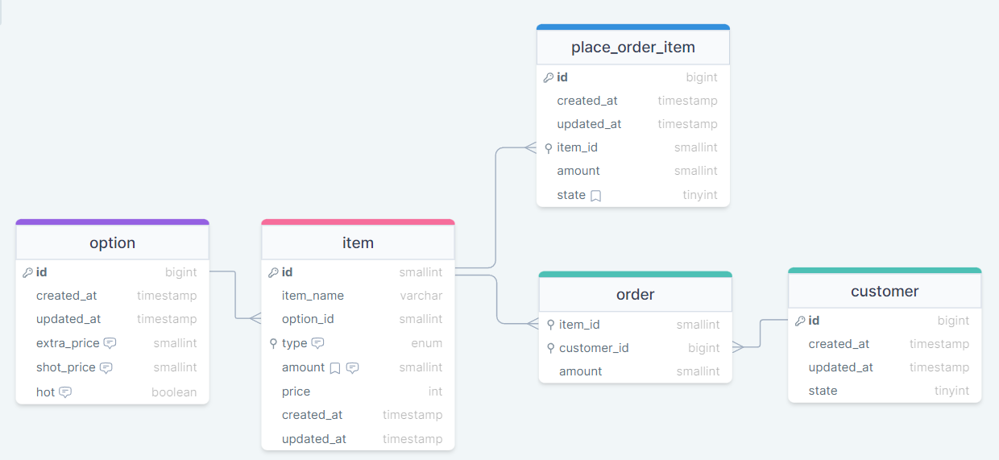

# kiosk

프로젝트의 기능

- 상품(item) 관리: 보유중인 상품 관리
- 발주 관리(place_order_item) 관리: 상품의 발주관리
- 고객(customer)과 주문(order): 고객은 상품을 여러 개를 주문할 수 있음
- 상품 옵션 관리(option): 상품의 옵션을 선택할 수 있음(옵션 필수 선택)
  옵션: 아이스, 핫(default) / extra사이즈 선택가능 / 샷 추가
- 유저 : 관리자 / 일반회원, 비회원

ERD

https://drawsql.app/teams/team-1613/diagrams/kiosk-pj
